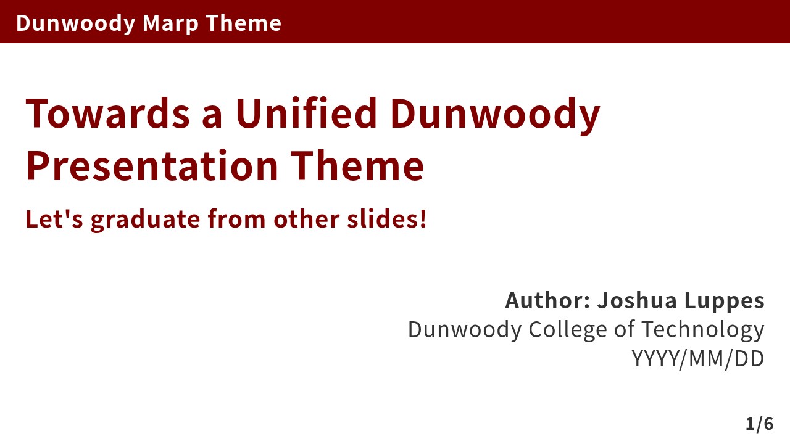
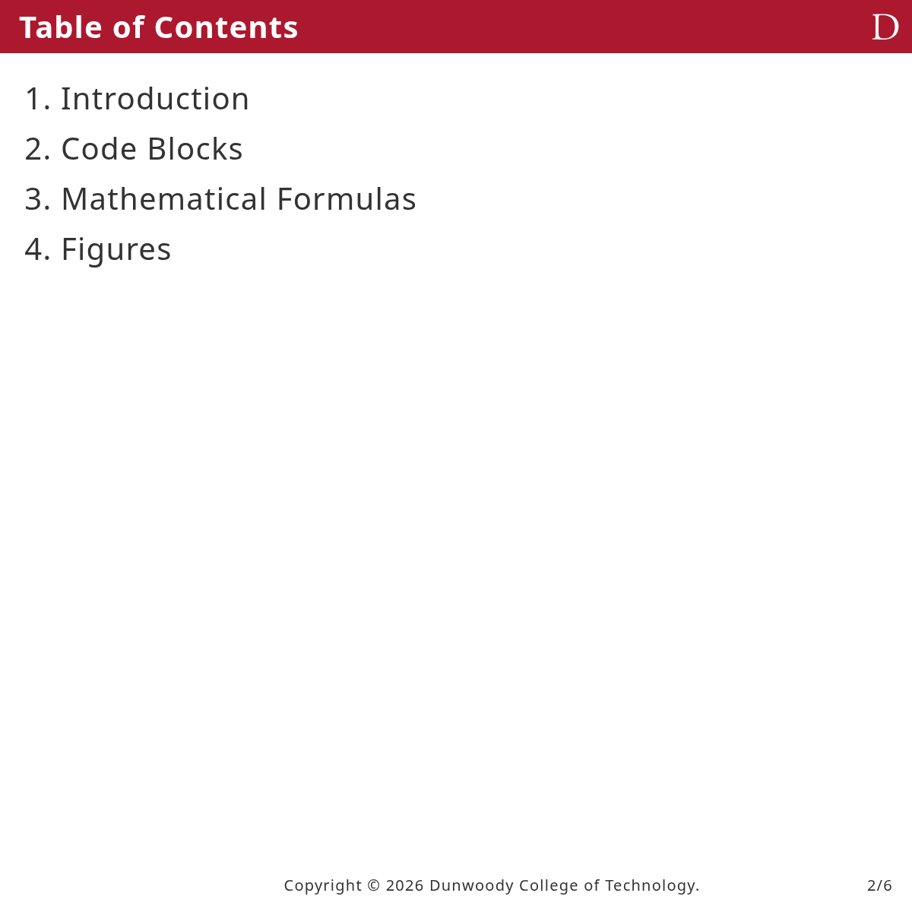
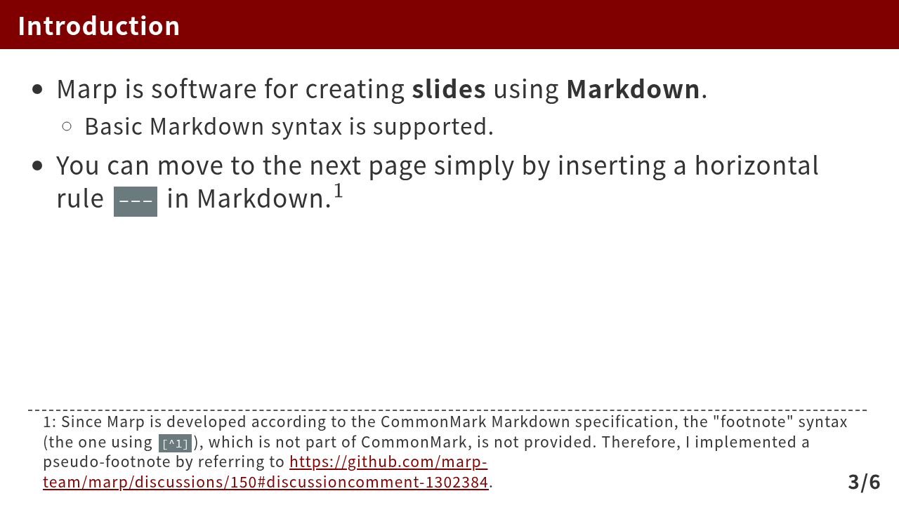
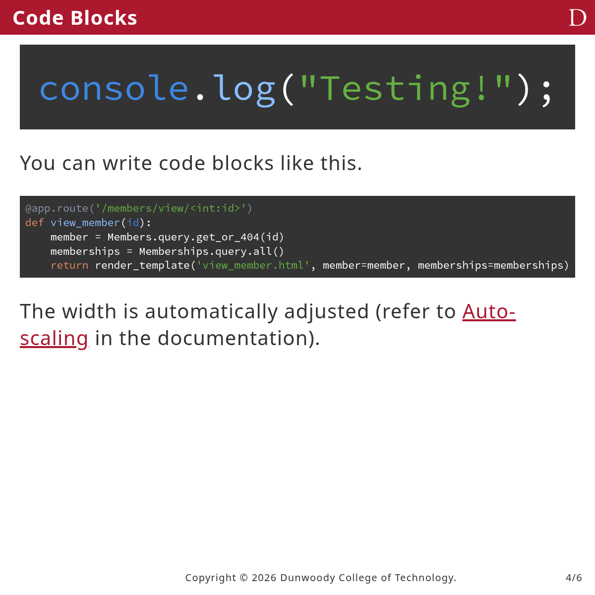
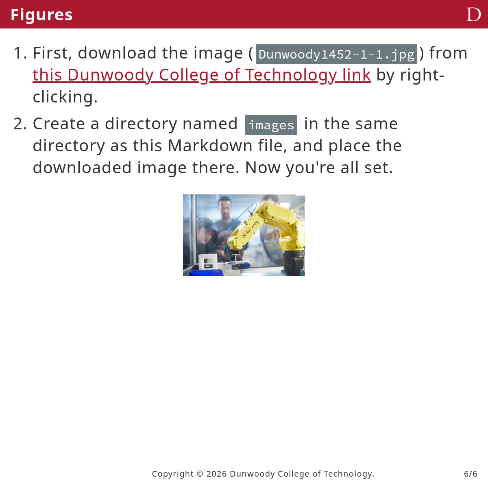

# marp-theme-dunwoody

This is a Marp theme made for Dunwoody classes.

## Usage

### Marp for VS Code

Follow the excellent instructions at the [Marp Community Themes page](https://rnd195.github.io/marp-community-themes/installation.html) to get started.

Paraphrased here:

1. Download the dunwoody.css file
1. Open Settings in VSCode (Ctrl + ,)
1. Search for “Marp: Themes” or “markdown.marp.themes”
1. After downloading the theme, add its local `./path/to/dunwoody.css` in the settings.
    - Alternatively, add this URL: `https://jluppes.github.io/marp-theme-dunwoody/themes/dunwoody.css`
1. Enable the theme in the front-matter of the Markdown document, i.e., write the following at the very beginning of the Markdown document:

```markdown
---
marp: true
theme: dunwoody
---
```


## Demo








## Credit

Forked from Kaisugi's [Academic theme](https://github.com/kaisugi/marp-theme-academic/).
